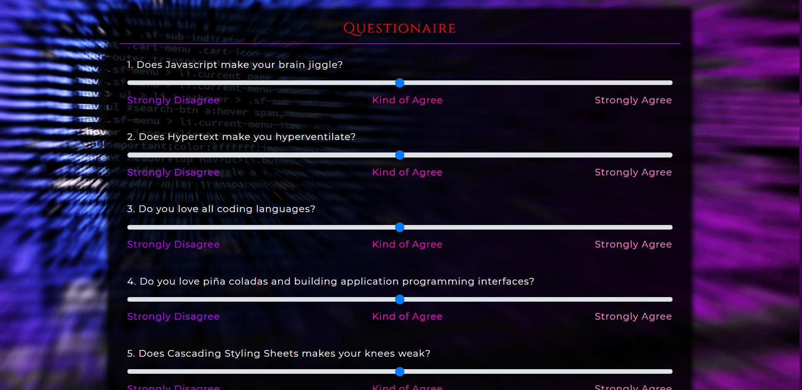

# Friend-Finder-Express

## About 📖
Friend Finder Express is a compatibility-based "FriendFinder" application... basically a dating app. This *full-stack* website takes in results from a user survey, then compares their answers with those from other users. The app then displays the name and picture of the user with the best overall match.


## How to Use 🤔

The user is greeted with a friendly home screen upon visiting the deployed heroku domain : [Coder Buddies!](https://tranquil-chamber-13000.herokuapp.com/).

This home screen contains a "Survey" button which, when clicked, directs the user to the survey page.


Here the user is able to enter the required information and complete the survey questionaire to finder their new *Coder Buddy*!



When the user completes the survey successfully, they will be promted with a `modal` which displays their best match. The match is determined using *Javascript* compatibility logic.


The user also has the available option to click the *Friends List* icon in the top right corner of the browser. This will direct them to page a which displays a JSON of all possible friends.


## How it Works 🔨

**HTML ROUTES**

`htmlRoutes.js` includes the following two routes:

* A default, catch-all route that directs the user to home.html which displays the home page.

```
    // Include default catch all route that displays home page
    app.get("/", function(req, res) {
        res.sendFile(path.join(__dirname, "../public/home.html"));
    });
```

* A GET Route to */survey* that directs the user to survey.html which displays survey page. 

```
    // Include route to display the survey page
    app.get("/survey", function(req, res) {
        res.sendFile(path.join(__dirname, "../public/survey.html"));
    });
```

**API Routes**

`apiRoutes.js` includes the following two routes:

* A GET route with the URL */api/friends*. This is used to display a JSON of all possible friends.

``` 
    // Display a JSON of all possible friends
    app.get("/api/friends", function(req, res) {
        return res.json(data)
    });
    
```

* A POST route with the URL */api/friends*. This is used to handle incoming survey results. This route is also used to handle the compatibility logic.

```
    // Handle incoming survey results and handle the compatibilty logic
    app.post("/api/friends", function(req, res) {
        
        // Store new user object
        let newUser = req.body;
        
        // Store new user score
        let userScore = newUser.scores;

        // Create variables to hold best match data
        let matchIndex = 0;
        let minDifference = 500;
        
        let tilde = "~~~~~~~~~~~~~~~~~~~~~~~~~~~~~~~~~~~~~~~~~~~~~~~~~~~~~~~~~~~~~~~~~~~~~~~~~~~~~~~~~~"

        // Iterate thu friends data to access score
        for (let i = 0; i < data.length; i ++) {
            
            // Store each friend score array
            let friendScore = data[i].scores;

            // Reset diff & total difference
            let totalDifference = 0;   
            let diff = 0;

            // Iterate thru each friend score array for compatibility logic
            for (let j = 0; j < friendScore.length; j ++) {
                
                // Calculate absolute difference between each user score and friend score
                diff = Math.abs(friendScore[j] - userScore[j]);
                totalDifference += diff;
                
            }

            // Determine lowest total difference and set as best match
            if (totalDifference < minDifference) {

                // If new lowest difference then set match index to current friend
                matchIndex = i;

                // If new lowest difference then set minDifference to current lowest totalDifference
                minDifference = totalDifference;
                
            }
        }

        // Push newUser to data array
        data.push(newUser);

        // Send browser the best match data
        res.status(200).json(data[matchIndex]);
    });
```

## Pre-Requisites ✔️

To power this app locally, you'll need to a install a couple `NPM Packages`. Downloading the following Node packages is crucial for this applications functionality.

* Express `npm install express`
* Path `npm install path`

OR

* Shorthand `npm i`

## Getting Started Locally🏁

The following steps will get you a copy of the application up and running on your local machine for testing and grading puproses.

1. Copy this repository from github by using clone.
2. Git clone repository in IDE of choice
3. Navigate to proper directory in IDE
4. If all pre-requisites are met, initalize the app by typing the command `node server.js`
5. ENJOY!

## Technologies Used 💻

* CSS3
* Express
* Git
* HTML5
* Javascript ES6
* JSON
* Node.js
* NPM
* VS Code

## Creator ✋

**Joey Kubalak**

AKA 

👇

*Treez* 🌲

Github profile 👉 [TreezCode](https://github.com/TreezCode)
